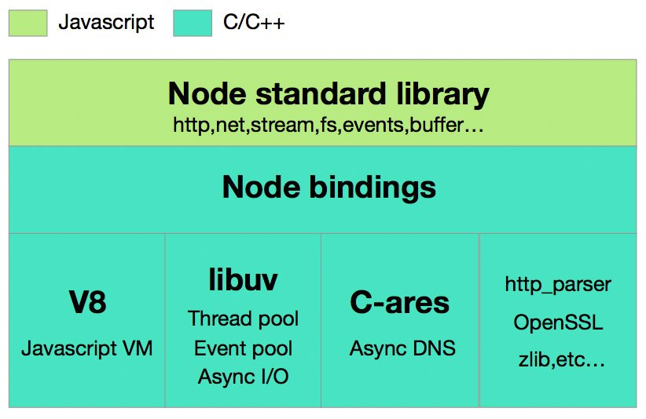

# Nodejs的事件循环

[参考文献1](https://github.com/yzfdjzwl/blog/blob/master/node/event-loop.md)

[参考文献2](https://cnodejs.org/topic/57d68794cb6f605d360105bf)

这玩意儿真的是一个相当复杂的东西，即使我看了一天，但依然没有完全弄清楚，更别说给别人说明白，不说废话了。

## Node结构

先看张图

这是Node的结构：

1. Node 标准库，就是我们平时用到的系统模块，fs,path什么的
2. Node 连接层，顾名思义，没啥好解释
3. Node 核心层，一会儿需要着重介绍的是libuv

## Eventloop

Nodejs启动后，会开启事件循环(Eventloop)，正常同步地运行脚本文件直到脚本末尾，若当前脚本中调用了任何异步函数，Nodejs会进入一个新的事件循环。事件循环中有几个阶段，如下图

```
   ┌───────────────────────┐
┌─>│        timers         │
│  └──────────┬────────────┘
│  ┌──────────┴────────────┐
│  │     I/O callbacks     │
│  └──────────┬────────────┘
│  ┌──────────┴────────────┐
│  │     idle, prepare     │
│  └──────────┬────────────┘      ┌───────────────┐
│  ┌──────────┴────────────┐      │   incoming:   │
│  │         poll          │<─────┤  connections, │
│  └──────────┬────────────┘      │   data, etc.  │
│  ┌──────────┴────────────┐      └───────────────┘
│  │        check          │
│  └──────────┬────────────┘
│  ┌──────────┴────────────┐
└──┤    close callbacks    │
   └───────────────────────┘

```

可以看到总共分为6个阶段，这6个阶段分别处理不同的异步回调函数。

1. Timers(计时器)：这个阶段执行setTimeout和setInterval注册的超时回调函数
2. I/O回调：一般处理由系统或者网络错误抛出的异常回调函数
3. idle,prepare：只内部使用，目前不需要关注
4. ***poll(轮询阶段)：捕获新的I/0事件，node可能会在合适的情况下阻塞在这个阶段***
5. check：setImmediate注册的函数会在这个阶段调用
6. close回调：调用例如socket.on('close',...)这种回调函数

每个阶段都维护着一个自己的fifo队列，到本阶段时，会将属于本阶段队列中的回调任务全部执行完，或者回调任务达到上限时，才会进入下一个阶段

***process.nextTick()函数不在任一阶段中***

## poll阶段

此阶段有两个功能：

1. 处理属于本队列的所有回调函数
2. 当超过Timers注册的函数设置的时间后，调用超时函数

详细说明：

若事件循环进入poll阶段，且没有Timers注册函数，则

* 若轮询队列不为空，则同步执行其中的函数，直到其为空或者回调函数达到上限
* 若轮询队列为空，
    * 若代码中调用了setImmediate注册了回调函数，事件循环将结束poll阶段而进入check阶段
    * *若代码没有调用setImmediate注册回调函数，事件循环将阻塞在poll阶段等待回调函数进入poll的队列(???)*

若在poll阶段内且代码中有注册Timers的回调函数，则

* 若轮询队列为空，事件循环检查Timers，若其中有任何Timers注册的函数超时，则事件循环按照上图顺序走过并进入Timers阶段执行其中的函数

为了更好的理解poll阶段究竟做了什么，怎么回事，这里有几个栗子

### 例1

```js
var fs = require('fs');

function someAsyncOperation (callback) {
  // 花费2毫秒
  fs.readFile(__dirname + '/' + __filename, callback);
}

var timeoutScheduled = Date.now();
var fileReadTime = 0;

setTimeout(function () {
  var delay = Date.now() - timeoutScheduled;
  console.log('setTimeout: ' + (delay) + "ms have passed since I was scheduled");
  console.log('fileReaderTime',fileReadtime - timeoutScheduled);
}, 10);

someAsyncOperation(function () {
  fileReadtime = Date.now();
  while(Date.now() - fileReadtime < 20) {

  }
});
```

运行结果是：

```console
setTimeout: 22ms have passed since I was scheduled
fileReaderTime 2
```

先执行了普通异步回调，再执行了setTimeout的回调

原因：

1. nodejs开启，同步运行代码，setTimeout向Timers对象中注册了一个超时事件为10ms的回调函数，然后主线程调用fs.readFile()函数
2. 第一个事件循环结束，开启第二个事件循环，进入timers阶段，此时timers中虽然有回调函数，但是因为未到指定时间(10ms)，所以跳过这个阶段
3. i/o callback 和 idle prepare阶段都跳过
4. poll阶段，阻塞，直到fs.readFile函数执行完成并向poll队列插入自己的回调函数。此时eventloop开始执行poll队列中的回调函数，代码中可以看到这个回调函数执行了20ms。执行结束之后，poll又进入空闲阶段，查看Timers中设置的时间10ms，现在已经超时，所以立即循环回timers阶段执行回调函数，所以出现setTimeout的回调延迟了22ms才输出的现象

### 例2

```js
var fs = require('fs');

function someAsyncOperation (callback) {
  var time = Date.now();
  // 花费9毫秒
  fs.readFile('/path/to/xxxx.pdf', callback);
}

var timeoutScheduled = Date.now();
var fileReadTime = 0;
var delay = 0;

setTimeout(function () {
  delay = Date.now() - timeoutScheduled;
}, 5);

someAsyncOperation(function () {
  fileReadtime = Date.now();
  while(Date.now() - fileReadtime < 20) {

  }
  console.log('setTimeout: ' + (delay) + "ms have passed since I was scheduled");
  console.log('fileReaderTime',fileReadtime - timeoutScheduled);
});
```

输出：

```console
setTimeout: 7ms have passed since I was scheduled
fileReaderTime 9
```

原因：

1. timers阶段跳过
2. 同例1
3. poll阶段，阻塞，运行到5ms时，timers中的函数超时，eventloop便跳过顺序运行至Timers阶段调用回调函数，但由于从poll阶段到timers阶段需要经过两个阶段，消耗了一点时间，所以timers中注册的回调函数实际是延迟了7ms调用，之后又回到poll阶段等待异步io，9ms时fs.readFile完成，则将其回调加入poll

## setTimeout和setImmediate

* setImmediate的回调函数只在check阶段执行
* setTimeout的回调在注册的超时时间到达且poll阶段空闲时调用

但是如下代码的输出是不稳定的

```js
setTimeout(function timeout () {
  console.log('timeout');
},0);

setImmediate(function immediate () {
  console.log('immediate');
});
```

有时候setTimeout先调用，有时候又是setImmediate先调用，这个问题要深入文章开头所说的libuv源码中去寻找答案

eventloop实现的C源码：

```c
int uv_run(uv_loop_t *loop, uv_run_mode mode) {
	int timeout;
	int r;
	int ran_pending;
	//uv__loop_alive返回的是event loop中是否还有待处理的handle或者request
	//以及closing_handles是否为NULL,如果均没有,则返回0
	r = uv__loop_alive(loop);
	//更新当前event loop的时间戳,单位是ms
	if (!r)
    	uv__update_time(loop);
	while (r != 0 && loop->stop_flag == 0) {
    	//使用Linux下的高精度Timer hrtime更新loop->time,即event loop的时间戳
    	uv__update_time(loop);
    	//执行判断当前loop->time下有无到期的Timer,显然在同一个loop里面timer拥有最高的优先级
    	uv__run_timers(loop);
    	//判断当前的pending_queue是否有事件待处理,并且一次将&loop->pending_queue中的uv__io_t对应的cb全部拿出来执行
    	ran_pending = uv__run_pending(loop);
    	//实现在loop-watcher.c文件中,一次将&loop->idle_handles中的idle_cd全部执行完毕(如果存在的话)
    	uv__run_idle(loop);
    	//实现在loop-watcher.c文件中,一次将&loop->prepare_handles中的prepare_cb全部执行完毕(如果存在的话)
    	uv__run_prepare(loop);

    	timeout = 0;
    	//如果是UV_RUN_ONCE的模式,并且pending_queue队列为空,或者采用UV_RUN_DEFAULT(在一个loop中处理所有事件),则将timeout参数置为
    	//最近的一个定时器的超时时间,防止在uv_io_poll中阻塞住无法进入超时的timer中
    	if ((mode == UV_RUN_ONCE && !ran_pending) || mode == UV_RUN_DEFAULT)
        	timeout = uv_backend_timeout(loop);
    	//进入I/O处理的函数(重点分析的部分),此处挂载timeout是为了防止在uv_io_poll中陷入阻塞无法执行timers;并且对于mode为
    	//UV_RUN_NOWAIT类型的uv_run执行,timeout为0可以保证其立即跳出uv__io_poll,达到了非阻塞调用的效果
    	uv__io_poll(loop, timeout);
    	//实现在loop-watcher.c文件中,一次将&loop->check_handles中的check_cb全部执行完毕(如果存在的话)
    	uv__run_check(loop);
    	//执行结束时的资源释放,loop->closing_handles指针指向NULL
    	uv__run_closing_handles(loop);

    	if (mode == UV_RUN_ONCE) {
        	//如果是UV_RUN_ONCE模式,继续更新当前event loop的时间戳
        	uv__update_time(loop);
        	//执行timers,判断是否有已经到期的timer
        	uv__run_timers(loop);
    	}
    	r = uv__loop_alive(loop);
    	//在UV_RUN_ONCE和UV_RUN_NOWAIT模式中,跳出当前的循环
    	if (mode == UV_RUN_ONCE || mode == UV_RUN_NOWAIT)
        	break;
		}
		
	//标记当前的stop_flag为0,表示当前的loop执行完毕
	if (loop->stop_flag != 0)
    	loop->stop_flag = 0;
	//返回r的值
	return r;
}
```

以上代码可以缩略成以下伪代码：

```C
while(true) {
    uv__update_time(loop); // 使用Linux下的高精度Timer hrtime更新loop->time,即event loop的时间戳
    uv__run_timers(loop);
    uv__run_pending(loop);
    uv__run_idle(loop);
    uv__run_prepare(loop);
    uv__io__poll(loop, timeout);
    uv__run_check(loop);
    uv__run_closing_handlers(loop);

    // Node默认的mode是`UV_RUN_ONCE`
    if (mode == UV_RUN_ONCE) {
        uv__run_timers();
        uv__update_time(loop); // 更新loop->time
    }
}

```

解释：在node里面，setTimeout(cb,0)===setTimeout(cb,1)，每次开启事件循环，都会先检查uv_run_timer，但是由于cpu准备会耗费时间，所以事件循环开启时会有两种情况：

1. 由于第一次loop前的准备耗时超过1ms，当前的loop->time >=1 ，则uv_run_timer生效，timeout先执行
2. 由于第一次loop前的准备耗时小于1ms，当前的loop->time = 0，则本次loop中的第一次uv_run_timer不生效，那么io_poll后先执行uv_run_check，即immediate先执行，然后等close cb执行完后，继续执行uv_run_timer

所以会出现两个回调发生顺序不稳定的情况

而以下代码：

```js
var fs = require('fs')

fs.readFile(__filename, () => {
  setTimeout(() => {
    console.log('timeout')
  }, 0)
  setImmediate(() => {
    console.log('immediate')
  })
})

```

则总是setImmediate先执行，这个比较好理解。

## process.nextTick()

此函数不在事件循环的任一阶段执行，而是在任一阶段切换到下一阶段的中间阶段执行

***递归调用process.nextTick会导致程序阻塞***


## MacroTask 宏任务 ？？MicroTask 微任务

***高能预警***

[参考资料3](https://jsblog.insiderattack.net/event-loop-and-the-big-picture-nodejs-event-loop-part-1-1cb67a182810)

由之前所述我们大概可以厘清Nodejs四种队列

1. 超时触发队列，间隔触发队列:timers
2. IO事件队列：poll
3. 立即触发队列：check
4. 句柄关闭队列：close

除此之外,还有两种队列，这两种队列不是libuv提供的，而是Nodejs自己的，他们被称作‘中间任务’(intermediate queues)

1. Next Ticks Queue:由process.nextTick触发的函数
2. 其他微任务:例如promise的resolve回调


如图所示，node中的事件循环可以看成四个队列按序清空，但从一个队列到下一个队列或者说阶段的中间，node都会去检查intermediate queues，若其中有回调函数则会调用并清空。

需要注意的是intermediate queues中Next Ticks Queue的优先级总是比其他微任务要高