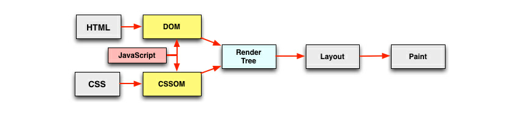

# html页面渲染

------

[TOC]

## 浏览器与服务器交互过程

1. 输入网址
2. 浏览器查找域名的IP地址
3. 浏览器给服务器发送一个HTTP请求
4. 若重定向，则会想重定向地址再发一次HTTP请求
5. 服务器处理请求，并返回响应，一般是一个html
6. 浏览器开始显示html
7. 若html中嵌入了其他资源地址，浏览器会发送请求到该地址去请求资源，这些资源包括CSS/JS/图片等

## 页面的生成过程

1. 解析html，html+htmlParser，构建dom tree
2. 解析CSS，CSS+CSSParser，构建style rules tree
3. 将dom tree和style rules tree合并，构建render tree，到这里浏览器就可以得到网页中的节点CSS信息以及相互之间的关系了
4. 根据render tree计算每个节点在屏幕中的位htmlRender.png置，这步称为layout
5. 绘制，遍历render tree，并用浏览器接口绘制节点

## 重绘(repaint)和重排(reflow)

* 重绘

  改变某个元素的背景颜色，文字颜色，不影响布局的属性，会引起重绘，不一定引起重排

* 重排

  * 添加，移除或改变可见的DOM元素
  * 添加，移除或改变CSS样式导致的布局变化时
  * CSS动画和过渡
  * 使用offsetWidth和offsetHeight时(???)

  改变页面布局的变化，会引起重绘，因为渲染树需要重新计算

## 减少重绘和重排

1. CSS样式集中修改
2. DOM深度尽可能小
3. 如果可能，将有动画的元素移除到文档流之外，这样动画效果就不会改变布局而出发重排