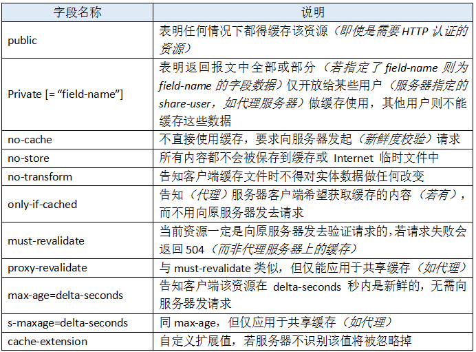

# Http缓存机制

## http报文中与缓存相关的首部字段

1. 通用首部字段

|字段名|说明|
|:--------:|:--------:|
|Cache-control|控制缓存的行为|
|Pragma|http1.0的遗产，值为‘no-cache’时禁用缓存|

2. 请求首部字段

|字段名|说明|
|:--:|:-:|
|If-Match|比较ETag是否一致|
|If-None-Match|比较ETag是否不一致|
|If-Modified-Since|比较资源最后更新时间是否一致|
|If-Unmodified-Since|比较资源最后更新时间是否不一致|

3. 响应首部字段

|字段名|说明|
|:--:|:-:|
|ETag|资源的匹配信息|

4. 实体首部字段

|字段名|说明|
|:--:|:-:|
|Expires|http1.0的遗产，实体主体过期的时间|
|Last-Modified|资源的最后一次修改时间|

## 古老的缓存控制方法

### Pargma

当该字段值为‘no-cache’时，通知客户端不对该资源进行缓存。
Pragma是通用首部字段，在客户端使用时得这样
`<meta http-equiv="Pragma" content="no-cache">`
但这种禁用缓存的方式有比较大的局限性
- 只有IE认得这段Meta标签含义
- IE中识别到该meta标签时，并不一定会在请求字段上加Pragma，但的确会让当前页面每次都发新请求（仅限页面，页面上的资源不受影响）。也就是IE浏览器看到页面有这个属性就会禁用缓存，但是并不会在Http消息报头中增加这个属性。

### Expires

Pragma用来禁用缓存，Expires是用来启用缓存，定义缓存时间的字段。同样也只有IE认得这个字段。
`<meta http-equiv="expires" content="mon, 18 apr 2016 14:30:00 GMT">`
也可以把content里的内容改为-1或者0来使每次刷新页面都发新请求。
如果在服务端返回的报头中返回expires字段，那么在任何浏览器中都能正确设置资源缓存的时间。
如果Pragma和Expires都设置并且冲突的话，则以Pragma为准。并且Expires是以服务器上的时间为准，与服务器端时间不统一，会出现问题。

### Cache-Control

http1.1新增Cache-Control来定义缓存过期时间，优先级比Pragma，Expires都高。
Cache-Control是一个通用首部字段，格式为`"Cache-Control" ":" cache-directive`

* 作为请求首部时，cache-directive的可选值:

* 作为响应首部时，cache-directive的可选值:

同时我们也可以在html页面上添加meta标签来给请求报头加cache-control字段，并且cache-contorl允许自由组合可选值，比如：
`Cache-Control: max-age=3600, must-revalidate`
它的意思是该资源是从原服务器上取得的，且其缓存(新鲜度)有效时间为一小时，在后续一小时内，用户重新访问该资源无需发送请求。
但这种组合方式也有限制，比如no-cache字段不能和max-age,min-fresh,max-stale一起搭配使用。
组合的形式还能做一些浏览器兼容处理，例如在IE我们可以使用 no-cache 来防止点击“后退”按钮时页面资源从缓存加载，但在 Firefox 中，需要使用 no-store 才能防止历史回退时浏览器不从缓存中去读取数据，故我们在响应报头加上如下组合值即可做兼容处理：
`Cache-Control: no-cache, no-store`

## 缓存校验字段

1. Last-Modified

服务器将资源传送给客户端浏览器时，会将资源最后的修改事件带在这个字段里面再塞进报文头部返回。
浏览器会给资源标记上这个信息，下次请求时，将该时间信息附带在请求报文中一起发送给服务器做检查。
请求报文中的首部字段有两个:
* If-Modified-Since:value
`If-Modified-Since: Thu, 31 Mar 2016 07:07:52 GMT`
该头部指示服务器如果客户端传来的最后修改时间与服务器上的一致，则直接返回304和响应报头即可。
* If-Unmodified-Since:value
与前一个相反，若自value时间起该资源未被修改，则进行传输(==没理解应用场景==)

*注意*
* 若在服务器上该资源的修改时间发生了变化，但实际内容没有变化，则因为该字段的原因而将资源整个重新发送，浪费资源

2. ETag

http1.1推出的字段，服务器使用类似md5的哈希算法给指定资源计算出一个唯一值，在把资源传送给客户端的时候，会在把该值一起返回给客户端。
客户端保留该值，并在下一次请求时将其一并带给服务器，服务器比较其与当前该资源的etag值是否一致，就能判断资源是否被修改过了。
客户端通过两个首部字段将etag传给服务器
* If-None-Match:value
`If-None-Match: "56fcccc8-1699"`
若匹配失败则需要重发资源，否则直接返回304和响应头
* If-Match:value
*没明白是干嘛的，貌似也是前面那个的反*

---
如果 Last-Modified 和 ETag 同时被使用，则要求它们的验证都必须通过才会返回304，若其中某个验证没通过，则服务器会按常规返回资源实体及200状态码

[参考资料](http://www.cnblogs.com/vajoy/p/5341664.html)

