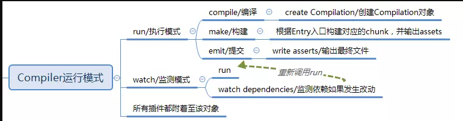

# webpack插件编写初探

[TOC]

## 写在前面

webpack这个玩意儿的插件是没有开发文档的，所有关于如何开发webpack插件的博客都是开发者自己参考一点儿官方插件说明然而自己根据某些插件的源码总结的，而很多都说的不明不白或者直接抄官方说明，所以经常很难。。这里尝试做一点自己的总结~~其实是抄别人的，因为我自己还总结不出来~~，有些文字虽然会记录在这里但我不一定真的了解他想说明什么

## 怎么写

* webpakc插件的实质是一个实现了名为`apply(compiler)`方法的一个类，其实一眼能看出这里是使用了函数式编程，因为我们自己并实例化这个类的任何对象。
* `compiler`是webpack利用`tapable`实现的一个对象，也是这个插件机制的核心，它通过`plugin()`在不同的生命周期函数订阅我们自定义的函数，**而我认为此插件开发中最难的就是如何找到合适的生命周期以及如何使用webpack在这个生命周期中提供的对象**

## 简单实例

一个很简单的例子：

```js
class MyPlugin {
	apply(compiler) {
		compiler.plugin(“compilation”, compilation => {
			compilation.plugin(“optimize-modules”, modules => {
				modules.forEach(…);
			}
		}
	}
}
```

可以看到我们在`compiler`中的compilation生命周期订阅了一个自定义函数，这个函数的入参是一个`compilation`对象，又在这个对象里的optimize-modules生命周期里订阅了一个入参为`modules`的函数，对这个对象做了一系列操作。。

$难点就在于这些生命周期的入参对象是什么能干嘛，包含满足我需求的对象在哪个生命周期里$

## webpack运行机制

有一些名词，或者说对象，是干嘛的需要解释，然后再简单描述一下webpack的运行机制，但有些是官方文档上的介绍，描述的其实我没切实的明白，但我只能抄过来。

> 1. compiler 对象
>
>    compiler对象代表了完整的webpack环境配置。该对象在启动webpack时就被一次性创建，由webpack组合所有的配置项（包括原始配置，加载器和插件）构建生成。
>      当在webpack环境中应用一个插件时，插件会收到compiler的引用，通过使用compiler，插件就可以访问到整个webpack的环境（包括原始配置，加载器和插件）。
>
> 2. compilation 对象
>
>    compilation对象在compiler的compile方法里创建，它代表了一次单一的版本构建以及构建生成资源的汇总：
>
>    （1）compilation对象负责组织整个打包过程，包含了每个构建环节及输出环节所对应的方法
>    该对象内部存放着所有module、chunk、生成的assets以及用来生成最后打包文件的template的信息
>
>    （2）当运行webpack-dev-server时，每当检测到一个文件变化，就会创建一次新的编译，从而生成一组新的编译资源。
>
> 3. 插件
>
>    ​	插件本质上是被实例化的带有apply原型方法的对象，其apply方法在安装插件时将被webpack编译器调用一次，apply入参提供了一个compiler（编译器对象）的引用，从而可以在插件内部访问到webpack的环境。
>      	具体使用方式，在webpack.config.js里require对应的插件，然后在module.exports对象的plugins数组里实例化对应插件即可。

### compiler运行模式

compiler有两种运行模式，一种是run执行模式，另一种是watch监测模式（热加载模式webpack-dev-server）。在执行模式下，compiler有三个主要的事件钩子：

1. compile/编译

   开始编译，创建对应的compilation对象。

2. make/构建

   根据配置的不同Entry入口构建对应的chunk块，并输出assets资源。

3. emit/提交


   将最终的assets资源写入硬盘，输出至指定的文件路径。


相比较，监测模式则分为两部分：

1. run执行模式
2. 监测依赖如果发生改动，重新回到第一步



### compiler事件钩子

执行模式下，compiler的事件钩子如下：

1. entry-option：生成不同的插件应用

   解析传给 webpack 的配置中的 entry 属性，然后生成不同的插件应用到 Compiler 实例上。这些插件可能是 SingleEntryPlugin, MultiEntryPlugin 或者 DynamicEntryPlugin。但不管是哪个插件，内部都会监听 Compiler 实例对象的 make 任务点

2. (before-)run：开始执行

   开始执行，启动构建

3. (before/after-)compile：编译源码，创建对应的Compilation对象

   Compiler 实例将会开始创建 Compilation 对象，这个对象是后续构建流程中最核心最重要的对象，它包含了一次构建过程中所有的数据。也就是说一次构建过程对应一个 Compilation 实例。

4. make：构建

5. (after-)emit：输出结果

6. done：结束

监测模式下有以下三个钩子：

1. watch-run
2. invalid
3. watch-close

同时，在Compiler里内嵌了compilation/编译对象、normal-module-factory/常规模块工厂、context-module-factory/上下文模块工厂，可以在事件钩子的回调函数里直接读取。但我完全不知道俩模块工厂是干嘛的


### compilation事件钩子

compiler的几个事件钩子贯穿了webpack的整个生命周期，但是具体到实际版本构建等操作，却是由compilation来具体执行。compilation对象是指单一的版本构建以及构建生成资源的汇总，它是在compiler的compile/编译事件里被创建，重点负责后续的添加模块、构建模块，打包并输出资源的具体操作（对应了compiler的make构建、emit输出）。

1. addEntry开始构建模块

   在compiler的make方法里开始构建模块，对应了compilation的addEntry方法开始添加模块该方法实际上是调用了_addModuleChain/私有方法，根据模块的类型获取对应的模块工厂并创建模块、构建模块。

   

   注意这张图的绿色箭头紧接上一张图的箭头

   首先，这里用了工厂模式来创建module实例，compilation通过读取每个module/模块的dependency/依赖信息，在依赖里读取对应的模块工厂，然后在用工厂的create事件创建出module实例。
   创建出module/模块后，再添加至compilation对象里，然后由compilation来统筹模块的构建和module的依赖处理。
   在处理module的依赖时，每一个依赖模块还是按照第一个步骤进行操作，迭代循环。直至模块及依赖完全处理完。

   ​

2. addModule添加模块

   我们可以看看addModule事件里发生了什么事情，整个addModule里分为两块：读取依赖工厂，把模块添加至compilation。在后面一个步骤里webpack专门做了一系列的优化逻辑。

   

   在addModule里，compilation会通过identifier判断是否已经有当前module，如果有则跳过

   * 如果没有的话，会在cache缓存里判断是否有这个模块，如果也没有那么直接添加至compilation里
   * 如果有那么就需要判断缓存里的模块是否已过期，是否需要重构（通过timeStamps判断），如果需要重构那么就触发disconnect事件，如果不需要重构，那么触发unbuild事件
   * 不管是否需要重构，只要缓存里有这个模块，都要添加至compilation里

   ​

3. buildModule构建模块

   经过上面的步骤，已经把所有的模块添加至compilation里，接下来是由compilation统筹进行构建

   

   构建模块是整个webpack最耗时的操作，在这里分为几个步骤：

   1. 读取module/模块，调用对应Loader加载器进行处理，并输出对应源码

      (1). 遇到依赖时，递归地处理依赖的module/模块
      (2). 把处理完的module/模块依赖添加至当前模块

   ​

   2. 调用acorn解析加载器输出的源文件，并生成抽象语法树 AST
   3. 遍历AST树，构建该模块以及所依赖的模块
   4. 整合模块和所有对应的依赖，输出整体的module

   ​

4. seal打包输出模块

   在构建完模块后，就会在回调函数里调用compilation的seal方法。Compilation的seal事件里，会根据webpack里配置的每个Entry入口开始打包，每个Entry对应地打包出一个chunk，逐次对每个module和chunk进行整理，生成编译后的源码chunk，合并、拆分、生成hash，最终输出Assets资源。

   

   针对每一个Entry入口构建chunk的过程有点类似上面的buildModule，具体细节可以查看流程图。在这里我们需要重点关注createChunkAssets生成最终的资源并输出至指定文件路径。

   

   在整个createChunkAssets过程里，有个有意思的地方需要注意，就是mainTemplate、chunkTemplate和moduleTemplate。template是用来处理上面输出的chunk，打包成最终的Assets资源。但是mainTemplate是用来处理入口模块，chunkTemplate是处理非入口模块，即引用的依赖模块。
   通过这两个template的render处理输出source源码，都会汇总到moduleTemplate进行render处理输出module。接着module调用source抽象方法输出assets，最终由compiler统一调用emitAssets，输出至指定文件路径。

   

   我们需要注意一下mainTemplate的render(render-with-entry)方法，整个webpack通过该方法找到整个入口开始构建，引用依赖。如果我们想自定义AMD插件，把整个webpack编译结果包裹起来，那么我们可以通过mainTemplate的render-with-entry方法，进行自定义开发。

### 整体流程


## 有关如何编写一个生成AMD模块的插件


具体开发的思路，是通过在webpack打包输出最终资源时，从入口模块构建的节点入手，订阅compilation.mainTemplate的render-with-entry事件，在里边用AMD声明包裹住源码，然后返回即可。这样子后续展开依赖模块时也会统一被AMD声明所包裹。
具体插件源码如下：

```js
/** plugin.js **/
const ConcatSource = require('webpack-sources').ConcatSource,
      path = require('path')

class DefPlugin {
  constructor(name) {
  }

  apply(compiler) {
    compiler.plugin('compilation', (compilation)=>{
      compilation.mainTemplate.plugin('render-with-entry', function(source, chunk, hash){
        return new ConcatSource(`global.define(['require','module','exports'],function(require, module, exports) { 
          ${source.source()} 
        })`);
      }) 
    })
  }
}

module.exports = DefPlugin
```

[参考资料1](https://juejin.im/post/5a6fe4a0f265da3e46755b25)

[参考资料2](http://taobaofed.org/blog/2016/09/09/webpack-flow/)

[参考资料3](https://fengmiaosen.github.io/2017/03/21/webpack-core-code/)